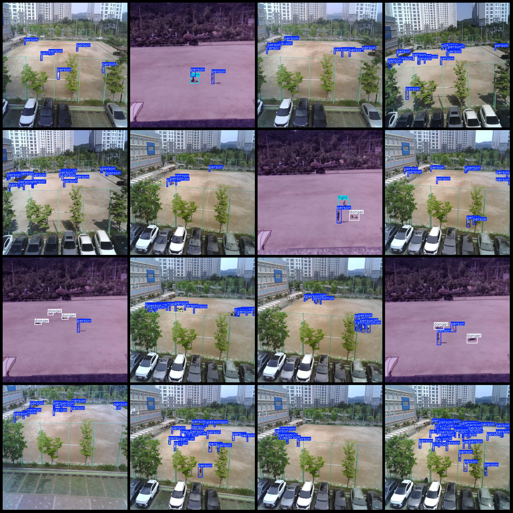
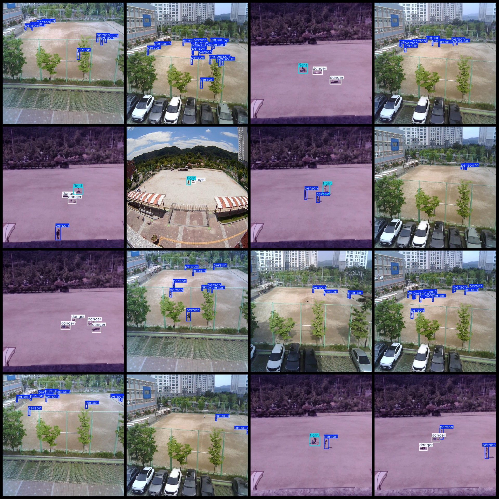

# Anomalous Behaviors in Schoolyard, Incidents of Fighting and Falling Dangers Detection Dataset in Monitoring Perspective - VOC+YOLO Format with 1433 Images and 3 Categories

Dataset format: Pascal VOC format + YOLO format (without split path in txt file, only contain jpg images and corresponding VOC format XML files and YOLO format txt files)

Number of images (jpg file counts): 1433
Number of annotations (xml file counts): 1433
Number of annotations (txt file counts): 1433
Number of annotation categories: 3
Annotation category names (note that the order of categories in YOLO format does not match this, but according to the labels folder's classes.txt): ["danger", "fight", "person"]
Each category has a number of bounding boxes:
danger bounding box count = 707
fight bounding box count = 182
person bounding box count = 12602
Total bounding box count: 13491
Each category occupies a number of images:
danger occupies images count = 403
fight occupies images count = 180
person occupies images count = 1344
Image resolution: 640x640
Annotation tool used: labelImg
Annotation rules: draw bounding boxes for each category
Important note: The dataset does not have been divided into training, validation, or test sets; you need to divide it yourself
Special declaration: This dataset does not guarantee the accuracy of the trained model or weight files
Image preview:
## Images

Here is a pay link on Stripe ( https://buy.stripe.com/3cs8yP7sY87d0vu9AB ). Please contact me lonlonago@foxmail.com after funding $89, and I will send you a complete data files , thank you!

